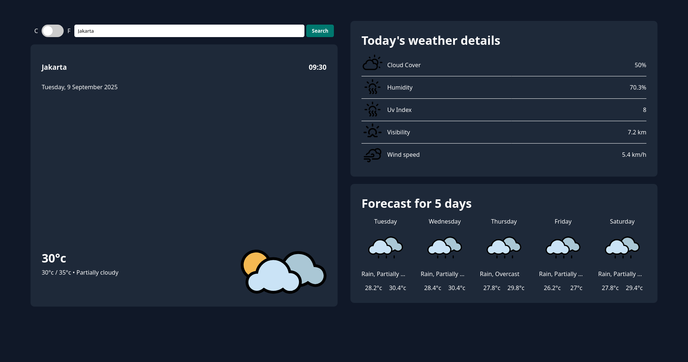

# Odin Weather App

This is submission for [Odin Weather App](https://www.theodinproject.com/lessons/node-path-javascript-weather-app#project-solution) project.

The design is taken from [https://github.com/0xabdulkhalid](https://weatherwiseapp.vercel.app/)

## Table of contents

- [Overview](#overview)
  - [The challenge](#the-challenge)
  - [Screenshot](#screenshot)
  - [Links](#links)
- [My process](#my-process)
  - [Built with](#built-with)
  - [What I learned](#what-i-learned)

## Overview

### The challenge

Users should be able to:

- Search and fetch weather data
- See the current and the next 5 days weather info

### Screenshot



### Links

- Live Site URL: [Live Preview](https://azanra.github.io/odin-weather-app/)

## My process

### Built with

- [Visual Crossing Weather API](https://www.visualcrossing.com/weather-api/) - Javascript async / await

### What I learned

```js
const fetchData = async (location, unitGroup) => {
  try {
    const response = await fetch(
      `https://weather.visualcrossing.com/VisualCrossingWebServices/rest/services/timeline/${location}?unitGroup=${unitGroup}&key=${API_KEY}`,
    );
    const result = await response.json();
    const { extractedCondition, daysCondition } = processData(result);
    return { extractedCondition, daysCondition };
  } catch (error) {
    console.log(error);
  }
};
```

By putting async to any way that we can write or declare a function, the function will return a promise, the promise will have two state, resolved, rejected state and the result. because the async keyword we can use await, await can be used for any async operation. in this case fetch, it will hold off moving on to the next line until the async operation is done. after fetching the data is finished, it will continue on to the next line.

To catch any error in async / await, we can use try and catch, where the catch block will be executed if any error happened in the try block. or you can call the async function and append catch method to it.
